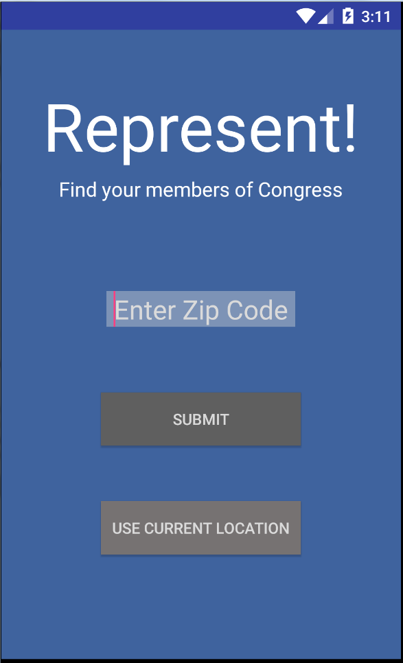
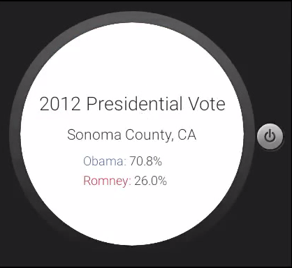
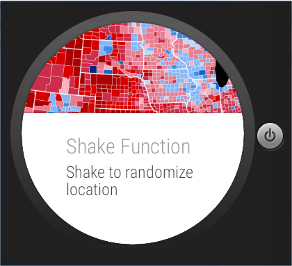

# PROG 02: Represent!

This app tells you information your members of Congress. You can enter a zip code or use your current location. 

## Authors

Tony Chen ([tonychenr@berkeley.edu](mailto:tonychenr@berkeley.edu))

## Demo Video

See [Represent] (https://youtu.be/9yom5475OiE)

## Screenshots

## Acknowledgments

* Hat tip to anyone who's code was used
* Any other support
* Big thanks to StackOverflow and Android Documentation